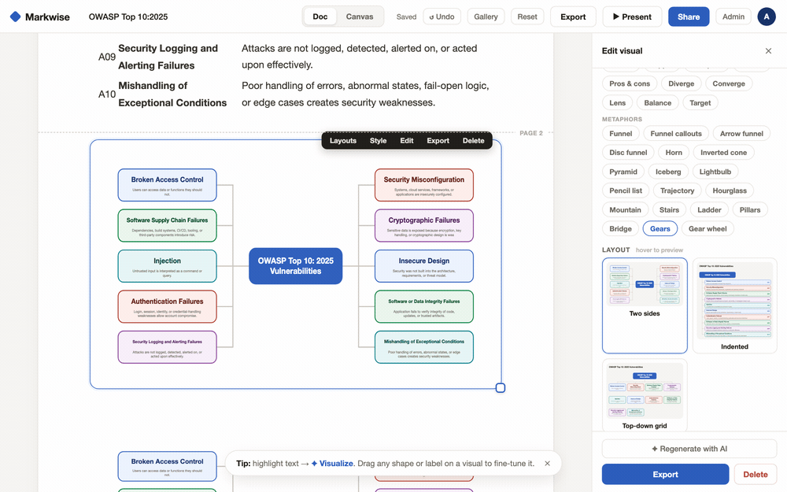
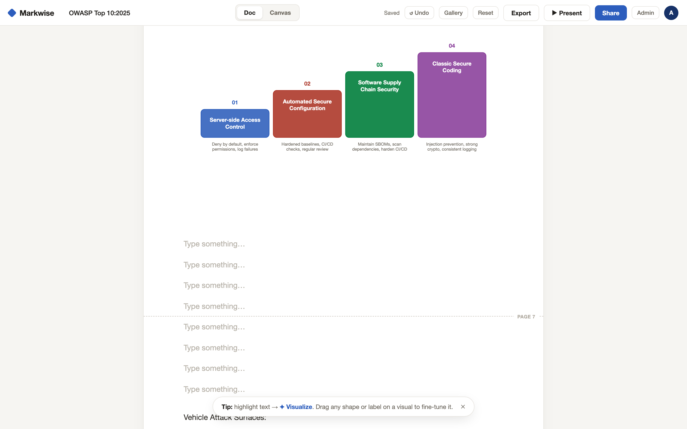
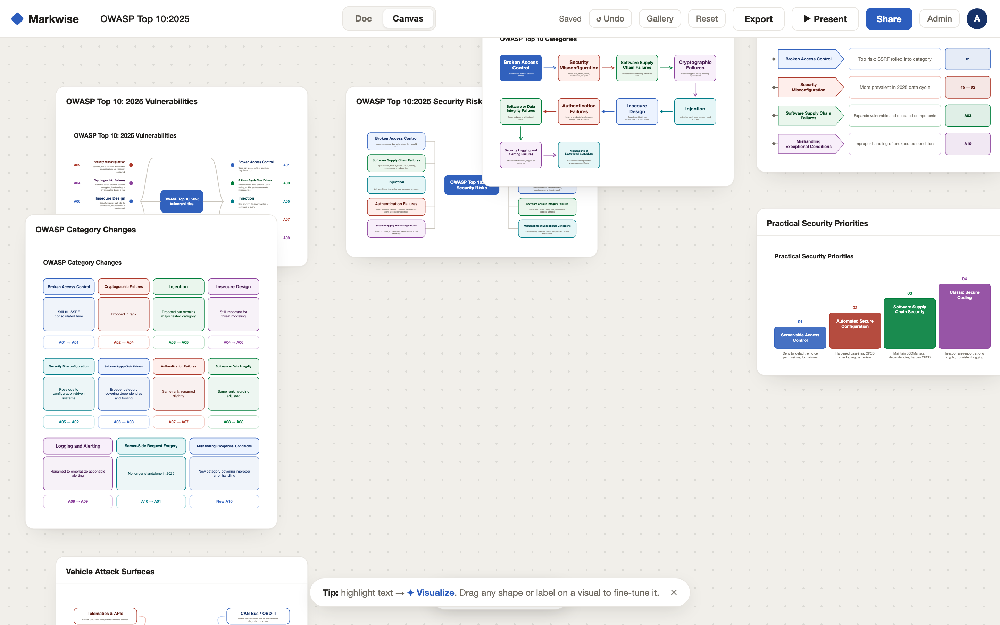
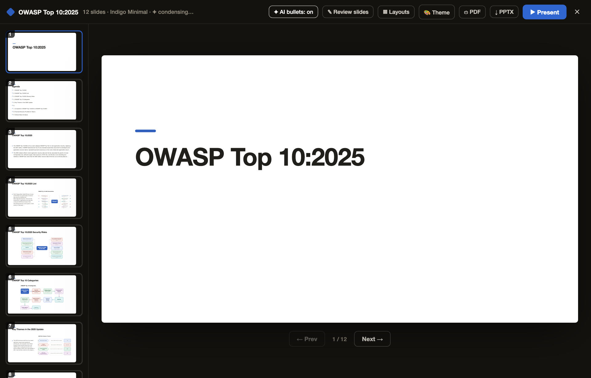
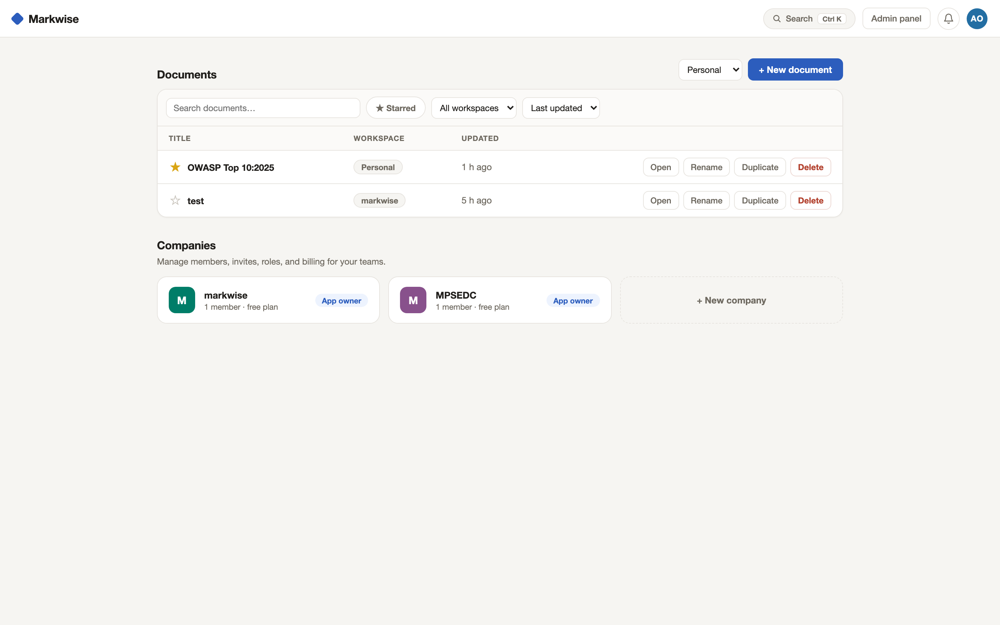
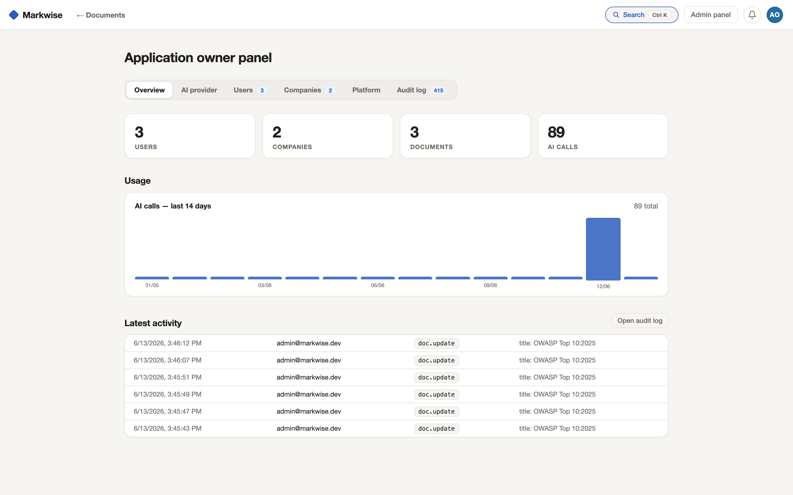
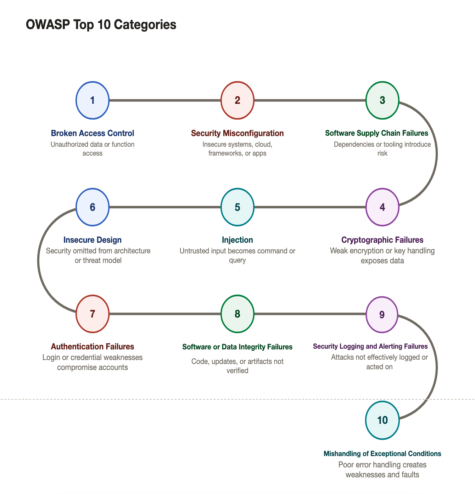
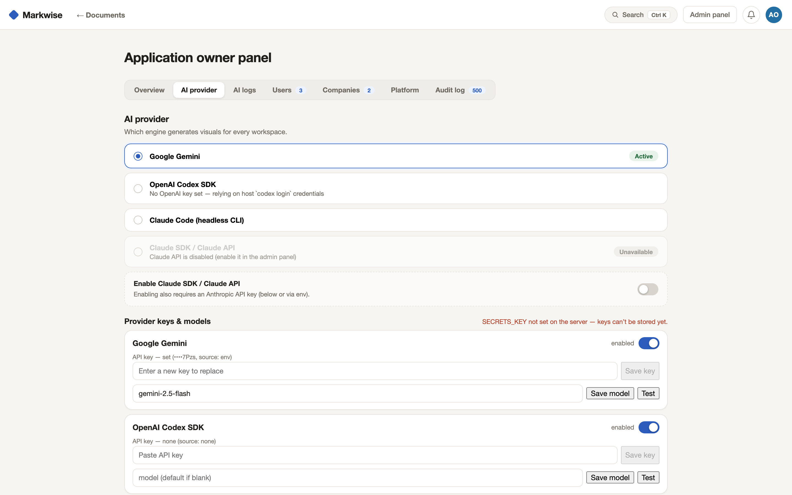
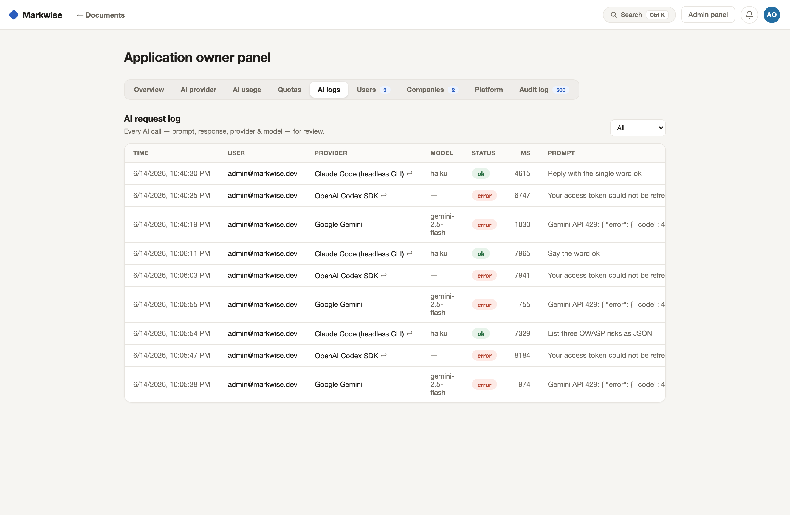
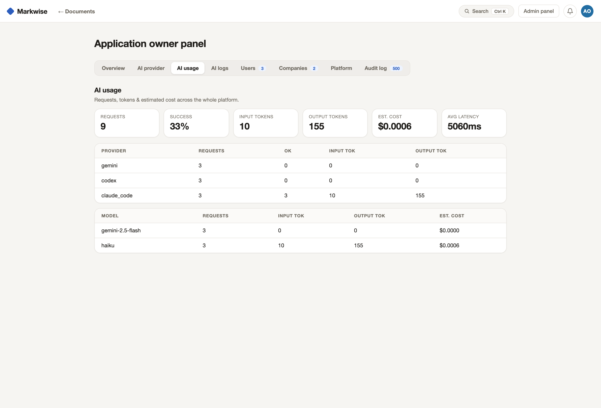

# Markwise — Write. Visualize. Present.

Turn text into visuals. Markwise is a document editor where you highlight a passage
and AI turns it into a diagram — ~90 diagram types, 26 render styles, a freeform
canvas board, a presentation builder with 200+ slide layouts, and export to
PNG / SVG / PDF / Word / Markdown / PPTX.

Now a fullstack app: accounts, companies with role-based access control, an
application-owner admin panel, and a pluggable AI provider layer.



> Select text → ✦ Visualize → pick a diagram → switch layouts live. Every type
> ships multiple layouts (e.g. Tree as *Two sides*, *Indented*, *Top-down grid*).

## Screenshots

| Editor | Canvas board |
|---|---|
|  |  |
| **Presentation builder** | **Dashboard** |
|  |  |
| **Application-owner admin panel** | **A diagram, up close** |
|  |  |
| **AI provider keys & models** — stored encrypted, set from the UI | **AI request log** — every prompt & response, for review |
|  |  |
| **AI usage** — requests, tokens & est. cost (individual / company / app-admin) | |
|  | |

## Quick start

```bash
# Requires Node 18+ and PostgreSQL
createdb markwise   # or use the credentials in server/.env.example

cd server
cp .env.example .env   # fill in DATABASE_URL and AI keys
npm install
npm run migrate
npm run seed           # prints the app-owner login once
npm run dev            # → http://localhost:3000
```

Sign in at `http://localhost:3000/login`. The account surface is a single-page
React app with clean URLs: the dashboard at `/docs`, org settings at `/org/:id`,
and the owner panel at `/admin`. The editor lives at `/index.html?doc=:id` and
shared docs open at `/share/:token`.

### Run with Docker

```bash
# App + PostgreSQL in one command. Optional: export CODEX_AUTH_JSON / APP_OWNER_PASSWORD first.
docker compose up --build   # → http://localhost:3000
```

The image runs migrations and the seed on boot (both idempotent) and restores
Codex CLI credentials from the `CODEX_AUTH_JSON` env var (the contents of
`~/.codex/auth.json` after a `codex login` on any machine).

### Deploy on Render

[render.yaml](render.yaml) is a Render blueprint: a Docker web service plus
managed PostgreSQL. Create a Blueprint in the Render dashboard, point it at
this repo, and set the two secrets it asks for: `APP_OWNER_PASSWORD` (seeded
admin) and `CODEX_AUTH_JSON` (Codex CLI auth — rotate anytime by re-running
`codex login` and updating the var).

## Features

- **Editor** — write a doc, select text, hit ✦ Visualize; pick from live diagram
  previews; click any element to recolor, **move, scale, or rotate** it (text and
  per-item icons alike), and tailor a visual's content to the diagram type
- **Canvas** — every visual as a draggable card on a pannable, zoomable board
- **Present** — build a deck from the document; 50 themes, 200+ slide layouts,
  full-screen present mode, PPTX/PDF export
- **Companies & RBAC** — default Owner/User roles plus custom roles with
  per-permission checkboxes; single-use invite links
- **Admin panel** — users, companies, audit log, the active-provider switch, plus
  **per-provider API keys & models stored AES-256-GCM encrypted in the DB and
  managed from the UI**, a full **AI request log** (every prompt, response,
  provider, model, status & latency) for review, and **detailed AI usage**
  dashboards (requests, tokens & est. cost by provider/model) at three scopes —
  individual, company, and platform-wide
- **AI providers** — Google Gemini via REST (default), OpenAI Codex SDK, Claude
  Code headless CLI, and Claude SDK/API (gated by a policy toggle). Keys & models
  are set in the admin panel (encrypted at rest) with env vars as fallback; the
  active provider is switchable, with automatic failover. No key? The built-in
  offline parser still generates diagrams deterministically.

## Development

See [CLAUDE.md](CLAUDE.md) for architecture, conventions, and the RBAC model, and
[DIAGRAM-TERMINOLOGY.md](DIAGRAM-TERMINOLOGY.md) for the diagram component vocabulary
and layout-variant naming reference. The platform roadmap (AI control plane,
enterprise identity, governance) lives in [ROADMAP.md](ROADMAP.md).
